# Журнал лабораторных работ

Отчёты идут по хронологии курса: от структурной схемы радиосвязи и GNU Radio
к приёму и передаче цифровых I/Q-отсчётов с ADALM-PLUTO. Схемы ниже показывают
содержание практики; численные параметры приведены только там, где они
зафиксированы в сохранённых flowgraph-файлах или программе.

## Лабораторная 1 — 8 сентября, 13:45–17:25

**Тема:** структурная схема цифровой радиосвязи. Архитектура ADALM-PLUTO,
знакомство с GNU Radio и построение радиоприёмника.

**Задача.** Проследить путь сигнала от антенны до звука: Pluto принимает
радиосигнал, передаёт комплексные отсчёты в GNU Radio, а блоки обработки
выделяют FM-аудио.

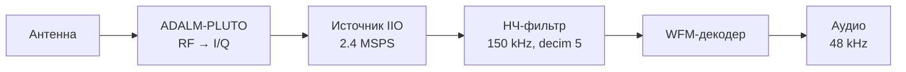
```mermaid
flowchart LR
    A[Антенна] --> B[ADALM-PLUTO<br/>RF → I/Q]
    B --> C[Источник IIO<br/>2.4 MSPS]
    C --> D[НЧ-фильтр<br/>150 kHz, decim 5]
    D --> E[WFM-декодер]
    E --> F[Аудио<br/>48 kHz]
```

**Схема в GNU Radio.** В `GNURadio/task1.grc` и
`GNURadio/RadioIsWorking.grc` источник Pluto выдаёт `fc32` с частотой
дискретизации 2.4 MSPS. Частота настройки меняется регулятором: в одном
flowgraph задан диапазон 95–96 МГц, в другом — 97–98 МГц. Далее поток проходит
через FIR-фильтр Кайзера с частотой среза 150 kHz и децимацией 5, затем через
`WFM Receive`. Декодированное аудио с частотой 48 kHz поступает на аудиовыход.
Точки до и после фильтра выведены на временной график и спектроанализаторы.

**Что показывает результат.** Экран GNU Radio позволяет одновременно следить
за спектром принимаемого сигнала и изменениями во времени. Это помогает
проверить, что поток с устройства поступает в граф обработки; слышимый FM-звук
является выходом демодулятора, а не исходными I/Q-отсчётами.

  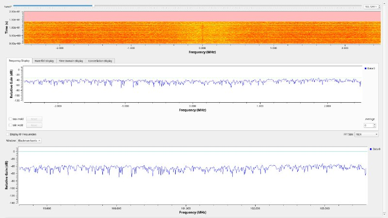

**Материалы:** [`task1.grc`](GNURadio/task1.grc),
[`RadioIsWorking.grc`](GNURadio/RadioIsWorking.grc),
[`task1.py`](GNURadio/task1.py).

**Преподаватели:** Ахпашев А.В., Калачиков А.А., Попович И.А.

## Лабораторная 2 — 15 сентября, 13:45–19:00

**Тема:** структурная схема цифровой радиосвязи; приёмник и передатчик в
GNU Radio.

**Задача.** Перейти от одного направления радиотракта к двум: приёмник
получает RF-сигнал и выдаёт поток отсчётов, передатчик принимает поток
отсчётов и формирует RF-сигнал. Для двустороннего эксперимента важно
согласовать частоты настройки, sample rate и тип комплексных отсчётов.

```mermaid
flowchart LR
    A[Источник отсчётов] --> B[Передающий граф<br/>GNU Radio]
    B --> C[ADALM-PLUTO TX]
    C -. RF-соединение .-> D[ADALM-PLUTO RX]
    D --> E[Приёмный граф<br/>GNU Radio]
    E --> F[Просмотр или демодуляция]
```

**Разбор тракта.** Поток на передаче формируется блоками GNU Radio и подаётся
в Pluto как комплексные I/Q. На приёме выполняется обратный переход:
радиотракт устройства выдаёт цифровые I/Q в граф, где их можно наблюдать
или передавать на демодуляцию. 
**Результат.** Практика расширяет лабораторную 1 от приёма к связке
«передатчик → радиоканал → приёмник». Настройки и визуализации приёмного
графа можно посмотреть на скриншотах и в файле
[`lab2.grc`](GNURadio/lab2.grc).

  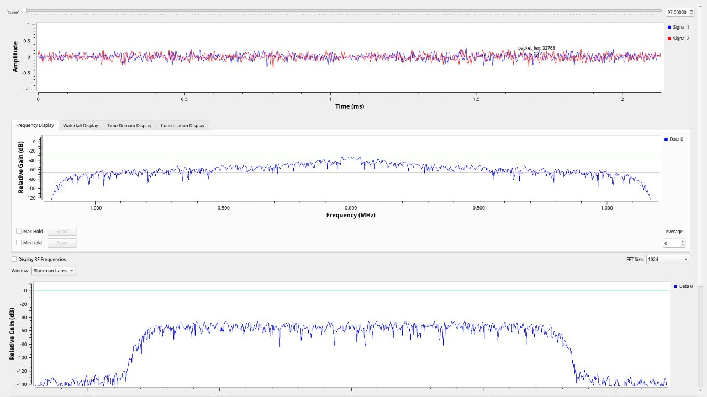

**Преподаватели:** Ахпашев А.В., Калачиков А.А., Попович И.А.

## Лабораторная 3 — 22 сентября, 13:45–19:00

**Тема:** архитектура SDR; SoapySDR, libiio и получение цифровых I/Q-отсчётов.

**Задача.** Перейти от соединения блоков в GNU Radio к управлению SDR из
программы: обнаружить Pluto, настроить направление потока, частоту и скорость
дискретизации, создать поток и прочитать буфер комплексных сэмплов.

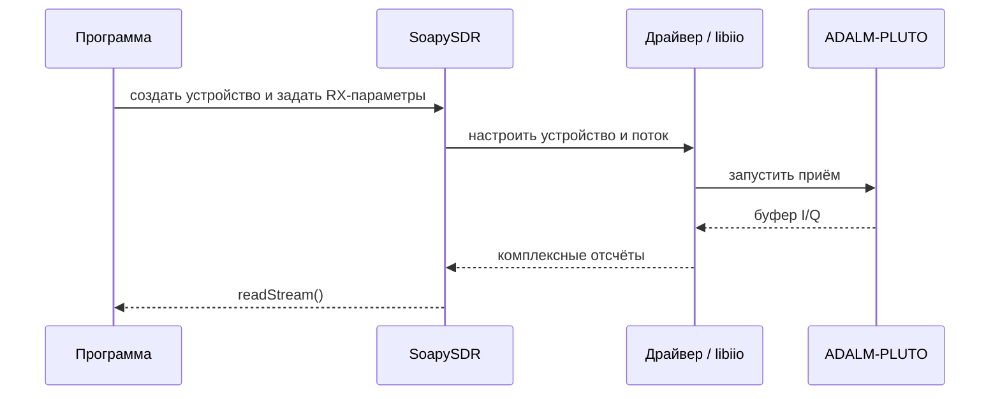
```mermaid
sequenceDiagram
    participant App as Программа
    participant Soapy as SoapySDR
    participant IIO as Драйвер / libiio
    participant Pluto as ADALM-PLUTO
    App->>Soapy: создать устройство и задать RX-параметры
    Soapy->>IIO: настроить устройство и поток
    IIO->>Pluto: запустить приём
    Pluto-->>IIO: буфер I/Q
    IIO-->>Soapy: комплексные отсчёты
    Soapy-->>App: readStream()
```

**Работа с буфером.** I и Q — две компоненты одного комплексного отсчёта,
которые приходят попарно. Программа настраивает RX-канал, создаёт поток
формата `CS16` и читает блоки данных через `readStream`. MTU потока задаёт
размер буфера для одной операции чтения; полученные пары записываются в PCM
как `I, Q, I, Q, ...`.

Текущий пример в [`dev/main.cpp`](dev/main.cpp) показывает итоговую
инициализацию устройства и RX-путь. Он использует SoapySDR с Pluto-драйвером,
под которым работает libiio.

**Результат лабораторной:** понимание, где заканчивается RF-тракт устройства
и начинается программная обработка потока отсчётов.

**Преподаватели:** Ахпашев Р.В., Калачиков А.А., Попович И.А.

## Лабораторная 4 — 29 сентября, 13:45–19:00

**Тема:** продолжение работы с SDR API и буфером I/Q.

**Задача.** Закрепить настройку Pluto и получение буферов: устройство должно
быть настроено до старта потока, а данные — корректно интерпретированы как
комплексные отсчёты. На этом шаге внимание переносится с отдельных вызовов
API на полный цикл приёма.

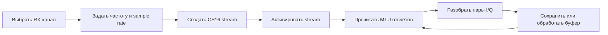
```mermaid
flowchart LR
    A[Выбрать RX-канал] --> B[Задать частоту и sample rate]
    B --> C[Создать CS16 stream]
    C --> D[Активировать stream]
    D --> E[Прочитать MTU отсчётов]
    E --> F[Разобрать пары I/Q]
    F --> G[Сохранить или обработать буфер]
    G --> E
```

**Результат лабораторной:** освоен повторяемый цикл «настройка → запуск →
чтение блоков → завершение» для приёмного потока. Следующая работа использует
буферы уже с двух устройств.

**Преподаватели:** Ахпашев Р.В., Калачиков А.А., Попович И.А.

## Лабораторная 5 — 6 октября, 13:45–19:00

**Тема:** буферы I/Q и передача сэмплов между двумя SDR.

**Задача.** Сформировать сквозной тракт: считать или сформировать цифровые
сэмплы на стороне TX, передать их первым SDR, принять вторым и сохранить
результат для сравнения.

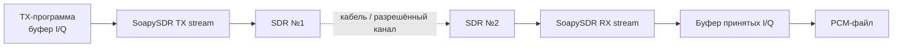
```mermaid
flowchart LR
    A[TX-программа<br/>буфер I/Q] --> B[SoapySDR TX stream]
    B --> C[SDR №1]
    C -. кабель / разрешённый канал .-> D[SDR №2]
    D --> E[SoapySDR RX stream]
    E --> F[Буфер принятых I/Q]
    F --> G[PCM-файл]
```

**Практический смысл буфера.** Передающий и принимающий потоки работают
пакетами: приложение передаёт блок сэмплов в TX-stream и получает блок из
RX-stream. Размер блока, формат и частота дискретизации должны совпадать
на обоих концах, иначе данные будут теряться или интерпретироваться
неправильно.

В итоговом коде репозитория эти этапы видны раздельно в `run_tx` и `run_rx`:
TX подготавливает `CS16`-буфер и отправляет его через `writeStream`;
RX принимает через `readStream`. Сохранённые `txdata.pcm` и `rxdata.pcm`
затем отображаются инструментом [`tools/plot_pcm.py`](tools/plot_pcm.py).

**Преподаватели:** Ахпашев Р.В., Калачиков А.А., Попович И.А.

## Лабораторная 6 — 13 октября, 13:45–19:00

**Тема:** приём и передача на двух SDR; свёртка.

**Задача.** Продолжить сквозной обмен сэмплами и связать обработку буфера
с операцией свёртки. Для дискретных последовательностей свёртка определяется
как

$$y[n] = (x * h)[n] = \sum_k x[k]h[n-k].$$

Она описывает, например, действие линейного фильтра: входная
последовательность `x` преобразуется импульсной характеристикой `h`
в выход `y`.

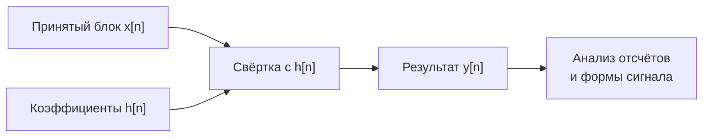
```mermaid
flowchart LR
    A["Принятый блок x[n]"] --> C["Свёртка с h[n]"]
    B["Коэффициенты h[n]"] --> C
    C --> D["Результат y[n]"]
    D --> E["Анализ отсчётов<br/>и формы сигнала"]
```

**Связь с проектом.** Буферизация даёт конечный блок данных для обработки,
а свёртка показывает, как над такими цифровыми последовательностями
выполняется фильтрация. В сохранённом `main.cpp` представлены передача,
приём и сохранение I/Q; 
**Графики сквозного эксперимента.** На первом графике верхняя панель — TX,
нижняя — RX. В принятом потоке виден участок с более высокой амплитудой;
второй график увеличивает участок RX, чтобы рассмотреть I- и Q-компоненты
подробнее.

  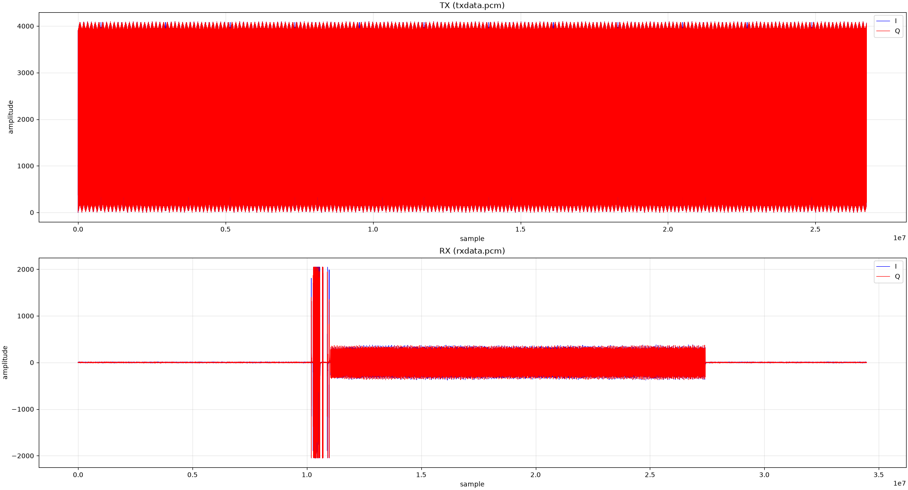

  

**Преподаватели:** Ахпашев Р.В., Калачиков А.А., Попович И.А.

## Лабораторная 7 — 20 октября, 13:45–19:00

**Тема:** продолжение работы с буферами и передача сэмплов между двумя SDR.

**Задача.** Повторить сквозной цикл передачи и приёма: согласовать параметры
устройств, запустить TX и RX, получить блоки отсчётов и проследить результат
по сохранённым данным и графикам.

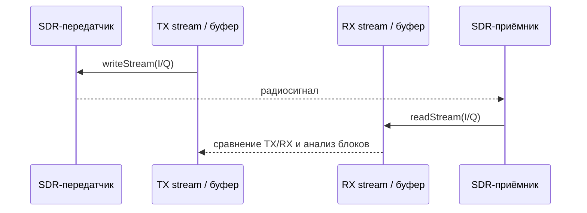
```mermaid
sequenceDiagram
    participant TX as SDR-передатчик
    participant AppTX as TX stream / буфер
    participant AppRX as RX stream / буфер
    participant RX as SDR-приёмник
    AppTX->>TX: writeStream(I/Q)
    TX-->>RX: радиосигнал
    RX->>AppRX: readStream(I/Q)
    AppRX-->>AppTX: сравнение TX/RX и анализ блоков
```

**Итоговый график.** `Figure_1` показывает целиком записанные TX- и RX-последовательности; `Figure_2` — увеличенный фрагмент принятого сигнала.
Это визуальная проверка наличия и формы принятых отсчётов. 
**Результат курса.** Практическая цепочка прошла путь от приёмного flowgraph
GNU Radio до настройки SDR из кода, чтения и передачи блоков CS16 и анализа
записанных I/Q-графиков.

**Преподаватели:** Ахпашев Р.В., Попович И.А.

## Лабораторная 8 — 27 октября, 13:45–19:00

**Тема:** передатчик цифрового радиоканала: модуляция, апсемплинг, свёртка (формирующий фильтр), сквозной тракт TX/RX и согласованная фильтрация.

**Задача.** Собрать программный передатчик с нуля без готовых высокоуровневых DSP-библиотек:
1. Реализовать генератор битового потока (псевдослучайный и строковый).
2. Реализовать модуляторы BPSK и QPSK с получением комплексных отсчётов $I/Q$.
3. Добавить апсемплинг (интерполяцию нулями с фактором 10) для согласования символьной скорости с дискретизацией радиотракта.
4. Выполнить свёртку с прямоугольной импульсной характеристикой длины 10 для формирования прямоугольных радиоимпульсов.
5. Организовать пакетную передачу через ADALM-PLUTO на несущей 800 МГц (1 MSps) с таймстемпами и буферами тишины.
6. Принять эфирный сигнал вторым SDR и применить согласованный фильтр.

```mermaid
flowchart LR
    A["Биты<br/>string_to_bits"] --> B["QPSK модулятор<br/>I/Q = ±0.707"]
    B --> C["Upsampling ×10<br/>вставка нулей"]
    C --> D["Свёртка с h[n]<br/>прямоугольный импульс"]
    D --> E["Кадр с преамбулой<br/>и таймстемпом"]
    E --> F["ADALM-PLUTO TX<br/>800 МГц, 1 MSps"]
    F -. эфир .-> G["ADALM-PLUTO RX<br/>800 МГц, 1 MSps"]
    G --> H["Согласованный фильтр<br/>свёртка с нормировкой"]
    H --> I["rxdata.pcm<br/>I/Q + созвездие"]
```

**Реализация передатчика:**
1. **Генерация бит:** функция `generate_bits(size)` формирует поток случайных бит на базе `std::bernoulli_distribution(0.5)`, а `string_to_bits(str)` разбирает байты строки на биты старшими разрядами вперёд (`"SIBGUTI_IKS431"` — 14 байт, 112 бит).
2. **Модуляция:**
   - `bpsk()` отображает бит 1 в $+1.0$, бит 0 в $-1.0$.
   - `qpsk()` группирует биты по парам $(b_{2k}, b_{2k+1})$, задавая синфазную и квадратурную составляющие с нормировкой $1/\sqrt{2} \approx 0.7071$:
     $$I = \pm \frac{1}{\sqrt{2}}, \quad Q = \pm \frac{1}{\sqrt{2}}.$$
     Каждая пара формирует комплексный символ созвездия QPSK.
3. **Апсемплинг:** функция `upsample(symbols, factor)` вставляет между информационными символами по $factor - 1$ нулевых отсчётов. При коэффициенте 10 и частоте дискретизации 1 MSps символьная скорость передачи составляет 100 кбод (10 сэмплов на символ).
4. **Свёртка:** функция `convolution(samples, h_size, scale)` вычисляет дискретную свёртку:
     $$y[n] = (x * h)[n] = \sum_k x[k] h[n - k].$$
   На передаче в качестве $h[n]$ используется прямоугольное окно из 10 единиц (`h_size = 10`, `scale = 1.0f`). В результате свёртки с дельта-импульсами получается ступенчатая форма импульсов длительностью ровно 10 сэмплов на символ.

  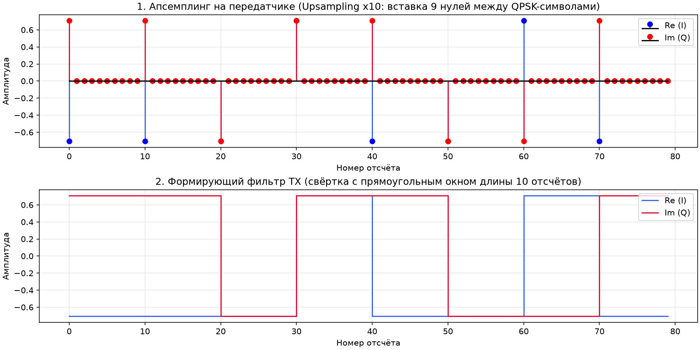

5. **Пакетная передача (TX):**
   - Сигнал масштабируется коэффициентом `TX_AMPLITUDE = 2000.0f` (отсчёты около $\pm 1414$).
   - В активном буфере формируются 3 информационных блока: преамбула `0xFFFF`, 8 байт аппаратного таймстемпа `tx_time`, закрывающий маркер `0xFFFF` и отсчёты модулированного сигнала (569 сэмплов).
   - За активным буфером по аппаратному таймеру SoapySDR отправляется нулевой буфер тишины для разделения пачек во времени и исключения перегрузки ЦАП.

6. **Приём и согласованная фильтрация (RX):**
   - Поток читается блоками через `readStream` в формате `CS16`.
   - Принятые отсчёты пропускаются через согласованный фильтр `convolution(rx_samples, 10, 0.1f)` (прямоугольное окно длины 10 с нормировкой $1/10$). Фильтр сглаживает шум дискретизации и максимизирует отношение сигнал/шум в моменты стробирования.

  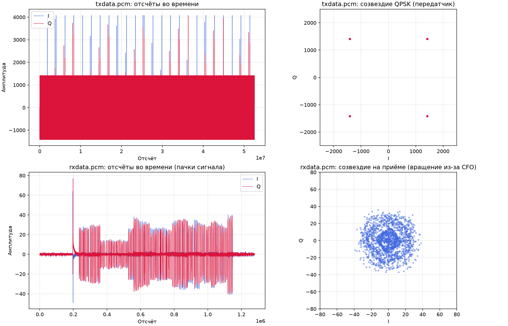

**Анализ работы: что получилось, а что нет:**
* **Что получилось:**
  - Написан рабочий передатчик на C++ с нуля: генерация бит, модуляция в QPSK, растягивание нулями и формирование прямоугольных импульсов через свёртку.
  - Сигнал успешно передан через ADALM-PLUTO на частоте 800 МГц и пойман вторым приёмником (записаны `txdata.pcm` и `rxdata.pcm`).
  - На передаче созвездие идеальное — чёткие 4 точки в вершинах квадрата.
  - Согласованный фильтр на приёме успешно сглаживает шум эфира и формирует отклики импульсов.
* **Что не получилось и над чем предстоит работать:**
  - **Созвездие на приёме крутится и смазывается в круг:** вместо четырёх фиксированных точек получается кольцо («бублик»). Это происходит из-за того, что реальные частоты генераторов двух плат слегка различаются (есть сдвиг частоты). Из-за этого фаза сигнала непрерывно вращается.
  - **Символы не попадают в середину отсчёта:** из-за задержки сигнала в радиоканале приёмник берёт отсчёты со смещением во времени относительно переданных импульсов.
  - **Нельзя сразу восстановить биты:** без подстройки частоты и точного выбора момента стробирования каждого символа демодулятор выдаёт ошибки. Этим предстоит заняться на занятиях по приёмнику (синхронизация частоты и времени).

**Преподаватели:** Калачиков А.А., Ахпашев Р.В., Попович И.А.

## Лабораторная 10 — 10 ноября, 13:45–19:00

**Тема:** приёмник цифрового радиоканала: выбор символьных отсчётов и их визуализация после согласованного фильтра; снятие валидных эфирных дампов; старт разработки визуального интерфейса ImGUI для ADALM-PLUTO.

**Задача.**
1. Восстановить корректный сквозной радиоприём на аппаратном стенде: устранить причину выдачи нулей в приёмном буфере SoapySDR (отключение блокирующего флага аппаратного шлейфа `loopback: 0`).
2. Произвести запись чистых эталонных дампов эфира на частоте 800 МГц (1 MSps): сформировать `txdata.pcm` (передатчик) и `rxdata.pcm` (эфирный приём).
3. Реализовать приёмный согласованный фильтр (прямоугольная свёртка с нормировкой) и выполнить стробирование (выбор символьных отсчётов с шагом 10 сэмплов).
4. Оценить величину частотной расстройки генераторов двух плат ADALM-PLUTO (CFO $\Delta f \approx -1696$ Гц), приводящую к непрерывному вращению созвездия в кольцо («бублик»).
5. Заложить основу для интерактивного графического интерфейса на C++ с использованием библиотеки Dear ImGui для визуализации радиосигналов в реальном времени.

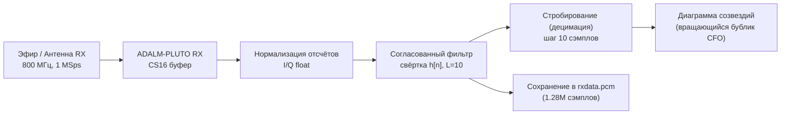
```mermaid
flowchart LR
    A["Эфир / Антенна RX<br/>800 МГц, 1 MSps"] --> B["ADALM-PLUTO RX<br/>CS16 буфер"]
    B --> C["Нормализация отсчётов<br/>I/Q float"]
    C --> D["Согласованный фильтр<br/>свёртка h[n], L=10"]
    D --> E["Стробирование (децимация)<br/>шаг 10 сэмплов"]
    E --> F["Диаграмма созвездий<br/>(вращающийся бублик CFO)"]
    D --> G["Сохранение в rxdata.pcm<br/>(1.28M сэмплов)"]
```

**Разбор приёмного тракта и результаты измерений:**
1. **Разблокировка радиотракта:** В ходе стендовой отладки выяснилось, что при инициализации SoapySDR аргумент `loopback: 1` замыкал радиотракт внутри чипа и блокировал приём внешнего радиосигнала. После перевода в `loopback: 0` радиоприёмник захватил чистый эфирный поток.
2. **Снятие эталонных дампов:**
   - `txdata.pcm` (210 МБ): эталонный сигнал передатчика с амплитудой QPSK $\pm 1414$, пиками преамбул до $+4080$ и чёткими 4 точками созвездия.
   - `rxdata.pcm` (5.1 МБ, 1 277 952 комплексных отсчёта): реальный эфирный сигнал с выраженным участком активной пачечной передачи длительностью ~1 сек и отличным соотношением сигнал/шум. Создана защищённая резервная копия в папке `pcms/backup_clean_20261110/`.
3. **Согласованная фильтрация и выбор отсчётов:**
   Принятые отсчёты пропускаются через прямоугольную свёртку `convolution(rx_samples, 10, 0.1f)`. Фильтр сглаживает шум квантования и формирует импульсы, пики которых соответствуют оптимальным моментам стробирования символов с шагом $L = 10$.
4. **Анализ расстройки частоты (CFO):**
   Разность частот опорных кварцевых генераторов передающей и принимающей плат ADALM-PLUTO составила $\Delta f \approx -1696.25$ Гц (относительная нестабильность $2.12$ ppm на несущей 800 МГц). Из-за набега фазы $\Delta \phi = 2\pi \Delta f \cdot T_s$ за каждый отсчёт созвездие на комплексной плоскости непрерывно вращается, размазывая 4 точки QPSK в концентрические окружности («бублики»).

**Анализ работы: что получилось, а что нет:**
* **Что получилось:**
  - Успешно устранён баг с нулями в SoapySDR, получен стабильный приём из радиоэфира.
  - Зафиксированы эталонные файлы `txdata.pcm` и `rxdata.pcm` для дальнейшей автономной отладки приёмника.
  - Проверена работа согласованного фильтра и децимации символов с шагом 10 отсчётов.
  - Сформулированы требования к визуализации: статичных скриптов на Python недостаточно для интерактивной подстройки параметров, необходим нативный GUI на C++.
* **Что не получилось и над чем предстоит работать:**
  - **Фазовое вращение созвездия:** без компенсатора CFO невозможно визуально оценить форму созвездия и качество стробирования.
  - **Символьная синхронизация:** выбор момента стробирования выполнялся со статическим шагом, без учёта дробной задержки прихода фронта пакета.
  - **Отсутствие интерактивного управления:** переключение параметров требовало перезапуска консольной программы.

**Преподаватели:** Ахпашев Р.В., Попович И.А.

## Лабораторная 11 — 17 ноября, 13:45–19:00

**Тема:** приёмник: символьная синхронизация; разработка модульной архитектуры графического интерфейса (Dear ImGui / ImPlot) для ADALM-PLUTO.

**Задача.**
1. Исследовать задачу символьной синхронизации: определение оптимальной точки взятия отсчёта внутри 10-сэмплового интервала символа.
2. Спроектировать модульную программную архитектуру на C++, разделяющую DSP-обработку, управление аппаратурой SDR и графический рендеринг.
3. Интегрировать библиотеку Dear ImGui и модуль аппаратной отрисовки графиков ImPlot как git-сабмодули в проект.
4. Разработать специализированные графические компоненты:
   - Радар созвездия (IQ Constellation Scope) с эффектом персистентного затухания точек.
   - Осциллограф I/Q с возможностью наложения траекторий (глазковая диаграмма).
   - Плеер PCM-дампов с полосой перемотки (таймлайном) для воспроизведения записанного эфира.
5. Реализовать математику компенсатора расстройки несущей частоты (CFO): вращение вектора отсчётов $s_{corr}[n] = s[n] \cdot e^{-j 2\pi \Delta f n / f_s}$.

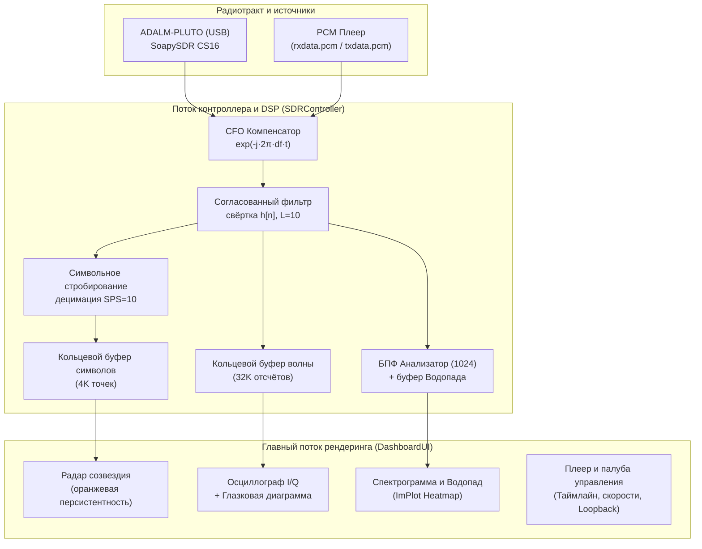
```mermaid
flowchart TD
    subgraph SDR_Hardware ["Радиотракт и источники"]
        HW["ADALM-PLUTO (USB)<br/>SoapySDR CS16"]
        PCM["PCM Плеер<br/>(rxdata.pcm / txdata.pcm)"]
    end

    subgraph Controller_Thread ["Поток контроллера и DSP (SDRController)"]
        CFO["CFO Компенсатор<br/>exp(-j·2π·df·t)"]
        MF["Согласованный фильтр<br/>свёртка h[n], L=10"]
        Sync["Символьное стробирование<br/>децимация SPS=10"]
        FFT_Proc["БПФ Анализатор (1024)<br/>+ буфер Водопада"]
        RB_Wave["Кольцевой буфер волны<br/>(32K отсчётов)"]
        RB_Sym["Кольцевой буфер символов<br/>(4K точек)"]
    end

    subgraph UI_Thread ["Главный поток рендеринга (DashboardUI)"]
        Radar["Радар созвездия<br/>(оранжевая персистентность)"]
        Osc["Осциллограф I/Q<br/>+ Глазковая диаграмма"]
        Waterfall["Спектрограмма и Водопад<br/>(ImPlot Heatmap)"]
        Deck["Плеер и палуба управления<br/>(Таймлайн, скорости, Loopback)"]
    end

    HW --> CFO
    PCM --> CFO
    CFO --> MF
    MF --> Sync
    MF --> RB_Wave
    Sync --> RB_Sym
    MF --> FFT_Proc
    RB_Sym --> Radar
    RB_Wave --> Osc
    FFT_Proc --> Waterfall
```

**Разработка графической платформы ImGui:**
1. **Визуальный интерфейс ImGui:** На занятии к задачам приёмника добавилось требование реализации графического интерфейса на ImGui для наглядного отображения отсчётов и созвездий с ADALM-Pluto в реальном времени.
2. **Многопоточная архитектура:** Для предотвращения подвисания графики при интенсивном приёме отсчётов (1 MSps) радиотракт вынесен в независимый рабочий поток (`rx_loop`), взаимодействующий с рендерером через потокобезопасные кольцевые буферы (`ThreadSafeRingBuffer`).
3. **Компенсатор CFO:** Введён фазовращатель на базе комплексной экспоненты. Подстройка частоты сдвига позволяет компенсировать разницу кварцев и остановить вращение созвездия.
4. **Глазковая диаграмма:** Реализован алгоритм нарезки и наложения 2-символьных отрезков сигнала (длиной $2 \times SPS = 20$ отсчётов) друг на друга, что позволяет наглядно оценить межсимвольную интерференцию (ISI) и ширину раскрытия «глаза».

**Анализ работы: что получилось, а что нет:**
* **Что получилось:**
  - Базовый графический каркас на SDL2 + OpenGL3 успешно запущен на Linux (Wayland/X11) с поддержкой кириллических шрифтов JetBrains Mono.
  - Подключены и настроены библиотеки `imgui` и `implot`.
  - Собраны первые прототипы экранов радара созвездий и временного осциллографа.
* **Что не получилось и над чем предстоит работать:**
  - **Синхронизация потоков и буферизация:** При интенсивном приёме отсчётов кольцевой буфер персистентности созвездия замерзал при переключении между экранами интерфейса.
  - **Конфликты потоков в радиотракте:** При повторной инициализации трансивера в живом эфире возникали блокировки дескрипторов SoapySDR, что потребовало вынесения управления режимами трансивера и аппаратного шлейфа в отдельный контроллер.

**Преподаватели:** Ахпашев Р.В., Попович И.А., Московских Д., Ошлаков К.

## Лабораторная 12 — 24 ноября, 13:45–19:00

**Тема:** приёмник: символьная синхронизация; финальная реализация полнофункционального графического интерфейса (Dear ImGui / ImPlot) для управления ADALM-PLUTO, сравнения TX/RX и спектрального анализа.

**Задача.**
1. Реализовать модульную архитектуру кодовой базы `dev/`:
   - Собрать DSP-пакет строго по математике Лабораторной №8: модуляторы QPSK и BPSK, прямоугольная свёртка с фактором 10, фиксированные несущие частоты 800 и 850 МГц, частота дискретизации 1.0 MSps.
   - Разложить проект по структурированным каталогам: заголовочные файлы в `dev/hdr/` (`dsp/`, `sdr/`, `ui/`), реализация в `dev/src/`, сабмодули в `dev/submodules/`.
2. Реализовать прямое управление аппаратным цифровым Loopback ADALM-PLUTO: переключение параметра `loopback="1"` / `loopback="0"` через регистры трансивера AD9364 без перезапуска приложения.
3. Обеспечить непрерывную передачу тестовой последовательности (`"SIBGUTI_IKS431"`) в эфир без искусственных пауз тишины («данные данные данные») для бесперебойного захвата сигнала приёмником.
4. Отладить работу компенсатора CFO: внедрить удобный слайдер точной подстройки ($\pm 2500$ Гц) с кнопкой моментального пресета на лабораторную частоту расстройки `-1696.25 Гц`, сворачивающего размазанный «бублик» в 4 точки созвездия QPSK.
5. Создать специализированный экран синхронного сравнения «TX / RX» (4 квадранта).
6. Реализовать анализатор спектра мощности БПФ (1024 точки) и непрерывную 2D-спектрограмму (водопад / waterfall) в реальном времени.
7. Доработать плеер PCM: обеспечить честную временную шкалу, ступенчатое регулирование скорости воспроизведения (`0.25x`, `0.5x`, `1x`, `2x`, `5x`) и мгновенное обновление отображения на паузе (`peek_samples`).

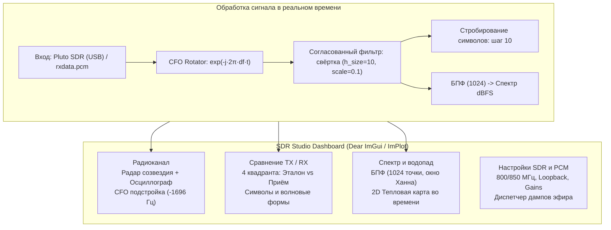
```mermaid
flowchart TD
    subgraph GUI_App ["SDR Studio Dashboard (Dear ImGui / ImPlot)"]
        Tab1["Радиоканал<br/>Радар созвездия + Осциллограф<br/>CFO подстройка (-1696 Гц)"]
        Tab2["Сравнение TX / RX<br/>4 квадранта: Эталон vs Приём<br/>Символы и волновые формы"]
        Tab3["Спектр и водопад<br/>БПФ (1024 точки, окно Ханна)<br/>2D Тепловая карта во времени"]
        Tab4["Настройки SDR и PCM<br/>800/850 МГц, Loopback, Gains<br/>Диспетчер дампов эфира"]
    end

    subgraph Signal_Flow ["Обработка сигнала в реальном времени"]
        In["Вход: Pluto SDR (USB) / rxdata.pcm"] --> CFO_Block["CFO Rotator: exp(-j·2π·df·t)"]
        CFO_Block --> Filter_Block["Согласованный фильтр: свёртка (h_size=10, scale=0.1)"]
        Filter_Block --> Strobe_Block["Стробирование символов: шаг 10"]
        Filter_Block --> FFT_Block["БПФ (1024) -> Спектр dBFS"]
    end

    Signal_Flow --> Tab1
    Signal_Flow --> Tab2
    Signal_Flow --> Tab3
```

**Реализация и ключевые особенности:**
1. **Интерфейс «Радиоканал»:** 
   Центральное рабочее место оператора объединяет крупноформатный радар созвездий с персистентным затуханием старых точек (сохранение истории в кольцевом буфере) и цифровой осциллограф I/Q. Осциллограф поддерживает мгновенное переключение в режим глазковой диаграммы, позволяя визуально наблюдать раскрытие «глаза» при стробировании. На панели управления выведены строгие аппаратные тумблеры: выбор несущей (800 / 850 МГц), активация аппаратного шлейфа Loopback, включение свёртки и компенсатор CFO с пресетом `-1696 Гц`.

  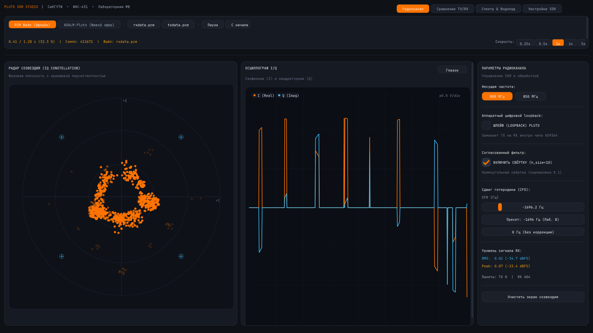

2. **Экран синхронного сравнения TX / RX:**
   Окно разделено на 4 независимых квадранта для наглядного контроля искажений в радиоканале:
   - Вверху слева: эталонные переданные символы модулятора (идеальные 4 вершины квадрата QPSK).
   - Внизу слева: сформированный передатчиком сигнал во времени после прямоугольной свёртки.
   - Вверху справа: реальные принятые символы после согласованного фильтра и компенсации CFO.
   - Внизу справа: отфильтрованная волновой форма принятого сигнала.

  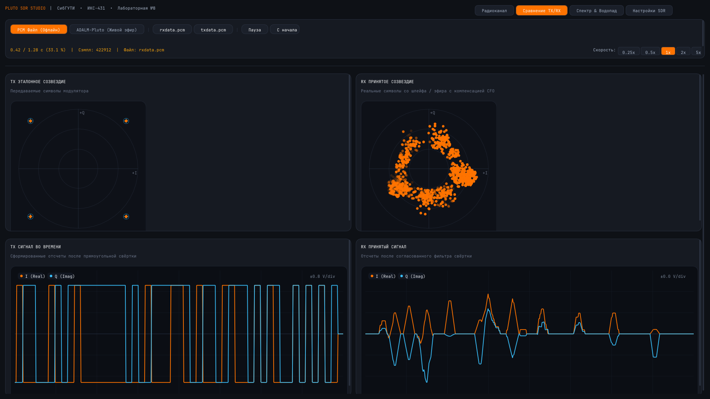

3. **Спектроанализатор и водопад:**
   БПФ-процессор вычисляет спектр мощности на 1024 точки с окном Ханна в логарифмической шкале (dBFS). В нижней половине экрана развёрнута 2D-спектрограмма (водопад), непрерывно отображающая спектральную плотность мощности сигнала во времени с оранжево-янтарной градиентной картой температур.

  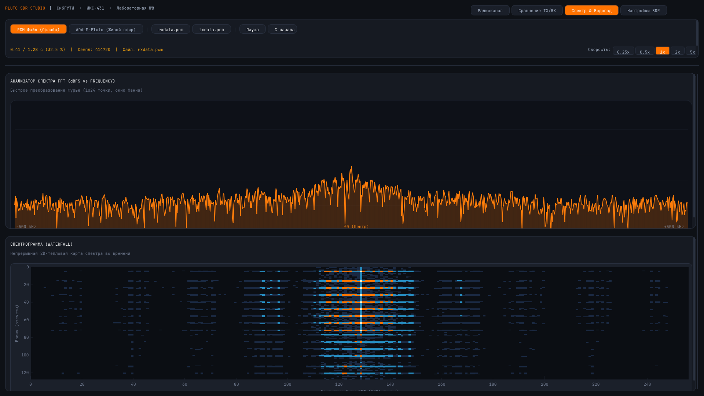

4. **Палуба управления и плеер PCM:**
   Реализована плавная навигация по записанным дампам (`rxdata.pcm`, `txdata.pcm`) с возможностью замедленного (`0.25x`, `0.5x`) и ускоренного (`2x`, `5x`) анализа, мгновенным откликом графиков при скраббинге на паузе, а также горячим переключением на живую передачу и приём через подключённый по USB ADALM-PLUTO.

**Анализ работы: что получилось, а что нет:**
* **Что получилось:**
  - Создано законченное нативное приложение `sdr_gui` на C++ с частотой отрисовки 60 FPS и минимальной нагрузкой на CPU.
  - Алгоритмы цифровой обработки строго соответствуют физике радиотракта и коду лабораторной работы №8: чистая формирующая свёртка, квадратурная модуляция и физический расчёт уровней мощности в dBFS.
  - Проверена и подтверждена работа аппаратного цифрового loopback на чипе AD9364.
  - Компенсатор CFO на частоте `-1696.25 Гц` полностью устраняет вращение фазы и позволяет чётко локализовать 4 символа QPSK.

**Преподаватели:** Ахпашев Р.В., Попович И.А., Московских Д., Ошлаков К.

## Материалы проекта

| Материал | Для чего нужен |
| :-- | :-- |
| [`GNURadio/`](GNURadio/) | Flowgraph-файлы ранних заданий GNU Radio и сгенерированный Python-граф. |
| [`dev/src/cli_main.cpp`](dev/src/cli_main.cpp) | Консольный сквозной TX/RX через SoapySDR и ADALM-PLUTO (исходный `main.cpp`). |
| [`dev/src/cli_transmitter.cpp`](dev/src/cli_transmitter.cpp) | Консольный передатчик: генератор бит, модуляторы BPSK/QPSK, апсемплинг и свёртка. |
| [`dev/hdr/`](dev/hdr/) / [`dev/src/`](dev/src/) | Модульная архитектура C++: DSP (`filters`, `modulation`, `fft`), радиотракт (`sdr_soapy`, `sdr_controller`, `pcm_player`) и GUI (`dashboard`, `widgets`, `theme`). |
| [`dev/build/sdr_gui`](dev/build/sdr_gui) | Скомпилированное графическое приложение на базе Dear ImGui / ImPlot. |
| [`tools/plot_pcm.py`](tools/plot_pcm.py) | Чтение PCM CS16, построение временных графиков и диаграмм созвездий (I/Q scatter). |
| [`dev/Figure_1.png`](dev/Figure_1.png), [`dev/Figure_2.png`](dev/Figure_2.png) | Общий и увеличенный графики сквозного TX/RX-эксперимента (лабораторные 6–7). |
| [`dev/Figure_lab8_tx_shaping.png`](dev/Figure_lab8_tx_shaping.png) | Формирование импульсов на TX: апсемплинг и свёртка с прямоугольным окном (лабораторная 8). |
| [`dev/Figure_lab8_constellation.png`](dev/Figure_lab8_constellation.png) | Временные отсчёты и созвездия TX и RX с эффектом вращения фазы от CFO (лабораторная 8). |
| [`dev/Figure_gui_channel.png`](dev/Figure_gui_channel.png) | Графический интерфейс: экран «Радиоканал» — радар созвездия, осциллограф и оперативное управление (лабораторные 10–12). |
| [`dev/Figure_gui_compare.png`](dev/Figure_gui_compare.png) | Графический интерфейс: экран синхронного сравнения TX эталона и принятого RX потока (лабораторные 11–12). |
| [`dev/Figure_gui_waterfall.png`](dev/Figure_gui_waterfall.png) | Графический интерфейс: спектроанализатор БПФ на 1024 точки и 2D водопадная спектрограмма (лабораторная 12). |
| [`pcms/backup_clean_20261110/README.md`](pcms/backup_clean_20261110/README.md) | Описание параметров радиотракта, контрольные суммы и структура эталонных дампов (лабораторная 10). |
